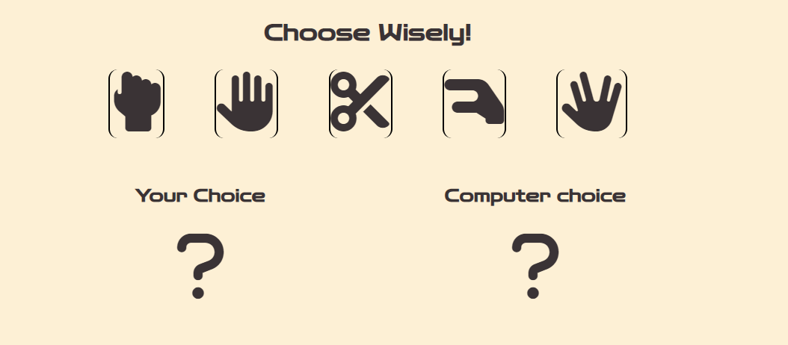

# Rock, Paper, Scissors, Lizard, Spock!

Rock, Paper, Scissors, Lizard, Spock! The title says it all. This is a minigame of the extended version of the rock, paper, scissors game. Adding the lizard and spock as extra possibilities. The game was originally invented by Sam Kass and Karen Bryla, but it wasn't widely known until the comedy central show "The Big Bang Theory" made it popular.

This minigame was build in a fully responsive JavaScript website. The human player will play against a computer based on a random number generator. The chances of you winning are as high as the chances of you losing.

## Features 

### Existing Features

- __The Title and the Heading__

  - Featured at the top of the page, the title and heading are easy to see for the user. It should be immediatly clear to the user what kind of website it is and which game you can play on this site.

- __The Game Rules__

  - This section shows the rules of the Rock, Paper, Scissors, Lizard, Spock! game. 
  - The rules are written in such a way, it should make clear to the user why some choices beat another choice. For example why does a rock beat a lizard? The rock crushes the lizard.
  - The rules are on top of the game. This way the user can always check why he or she lost or won the game.

- __The Game Section__

  - In this section the game begins when the user clicks one of the five option buttons. The buttons are made with font icons from Fontawesome. 
  - When the user clicks a button, the random number generator will activate to generate the computer choice of action.
  - The game will show both choices and presents the result of the round above the option buttons. 

- __The Score Section__

  - This section displays the scores of the player and the computer.
  - The score of the player is green and the score of the computer is red.

- __The Footer__

  - This section displays the creator of this "Rock, Paper, Scissors, Lizard, Spock!" minigame.

### Feature Ideas

- An idea for a new feature is to implement a highscore  section. This way the users can see how they stack up against other players

## Testing 

In this section, you need to convince the assessor that you have conducted enough testing to legitimately believe that the site works well. Essentially, in this part you will want to go over all of your project’s features and ensure that they all work as intended, with the project providing an easy and straightforward way for the users to achieve their goals.

In addition, you should mention in this section how your project looks and works on different browsers and screen sizes.

You should also mention in this section any interesting bugs or problems you discovered during your testing, even if you haven't addressed them yet.

If this section grows too long, you may want to split it off into a separate file and link to it from here.

### Validator Testing 

- HTML
    - No errors were returned when passing through the official [W3C validator](https://validator.w3.org/nu/?doc=https%3A%2F%2F8000-jdzelhorst-codeinstitut-9ozhtgbjal7.ws-eu78.gitpod.io%2F)
- CSS
    - No errors were found when passing through the official [(Jigsaw) validator](https://jigsaw.w3.org/css-validator/validator?uri=https%3A%2F%2F8000-jdzelhorst-codeinstitut-9ozhtgbjal7.ws-eu78.gitpod.io%2F&profile=css3svg&usermedium=all&warning=1&vextwarning=&lang=en)
- JavaScript
    - No errors were found when passing through the official [Jshint validator](https://jshint.com/)
      - The following metrics were returned: 
      - There are 9 functions in this file.
      - Function with the largest signature take 1 arguments, while the median is 0.
      - Largest function has 22 statements in it, while the median is 2.
      - The most complex function has a cyclomatic complexity value of 31 while the median is 1.
- Lighthouse

### Unfixed Bugs

- No unfixed bugs are known

## Deployment

This section should describe the process you went through to deploy the project to a hosting platform (e.g. GitHub) 

- This website was deployed to GitHub pages. The steps to deploy are:
  - In the GitHub repository, navigate to the Settings tab.
  - From settings click on "Pages" on the left.
  - Here we select the main branch and click save. 
- This the live [Link](https://jdzelhorst.github.io/Hacks4Life/)

## Credits 

- The Javascript code is inspired and based on the following repositories:
    -   CodeInstitute Rock, Paper, Scissors project
    -   CodeInstitute Love Maths walkthrough project
    -   Rock Paper Scissors by Christo107 [Link](https://github.com/Christo107/CI-PP-02-Rock_Paper_Scissors)
        - Big thank you to Christo107! It gave a lot of inspiration and ideas to write my code.
    - The icons on the entire website were taken from [Font Awesome](https://fontawesome.com/)
